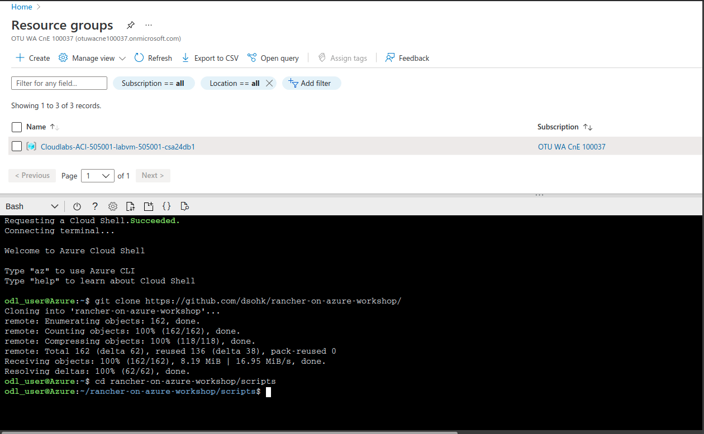
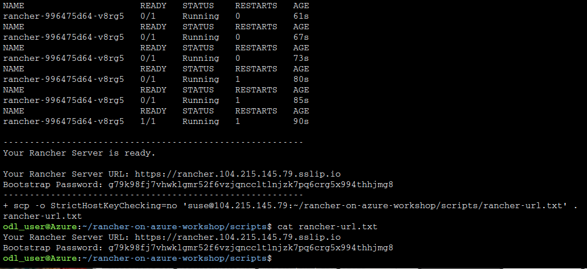
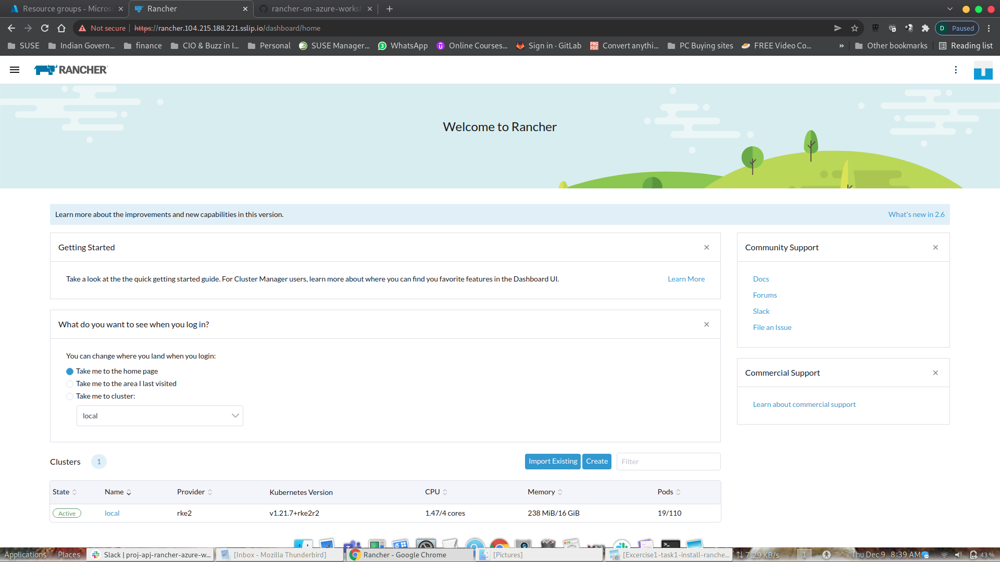

# Exercise 1: Install SUSE Rancher on Microsoft Azure Instance

Duration: 30 minutes

At this point, we are going to setup an instance of SUSE Rancher Server on Azure.

# Deploy SUSE Rancher

## Express Way (Task 1 & 2)

### Task 1 - Azure Shell, Git Clone Activity

**TIPS**: If you want to setup the Rancher Server on Azure automatically (task 1 and 2), we have prepared a script for you. To do this, please follow the steps below.

1. Open Azure Cloud Shell
2. In the Cloud Shell bash terminal, run the following command.

```bash
git clone https://github.com/dsohk/rancher-on-azure-workshop/
cd rancher-on-azure-workshop/scripts
```



### Task 2 - Install Rancher using script.

Run the command to create a resource group on Azure, deploy a VM within this group and install Rancher Server on this VM. This step will take about 10-15 mins to finish.

```bash
./startlab.sh
```




Rancher is now deployed. We are provided with Rancher URL and Bootstrap password. Open the Rancher URL is new browser Windows and use the Rancher Bootstrap password to login to Rancher. Task 3 cover Rancher Login

## Task 3 - Login to Rancher Server

1. Open a browser and navigate to the Rancher Server URL. Type **thisisunsafe** at the page where there's invalid SSL warning to continue. You will be leading to a first-time setup page of Rancher like below. Enter your bootstrap password to continue..


2. Set your own password.


3. Successful Login and Rancher Homepage.



### Next steps

In this exercise, you have deployed Rancher Server instance. 

In the next exercise, you will configure Rancher Server to create a few VMs on Azure and automate provisioning of a Kubernetes cluster, which integrates with Azure Load Balancer, on these VMs.

Now, you can move ahead to the [second exercise](./02-Provision-Kubernetes.md) of the lab.


