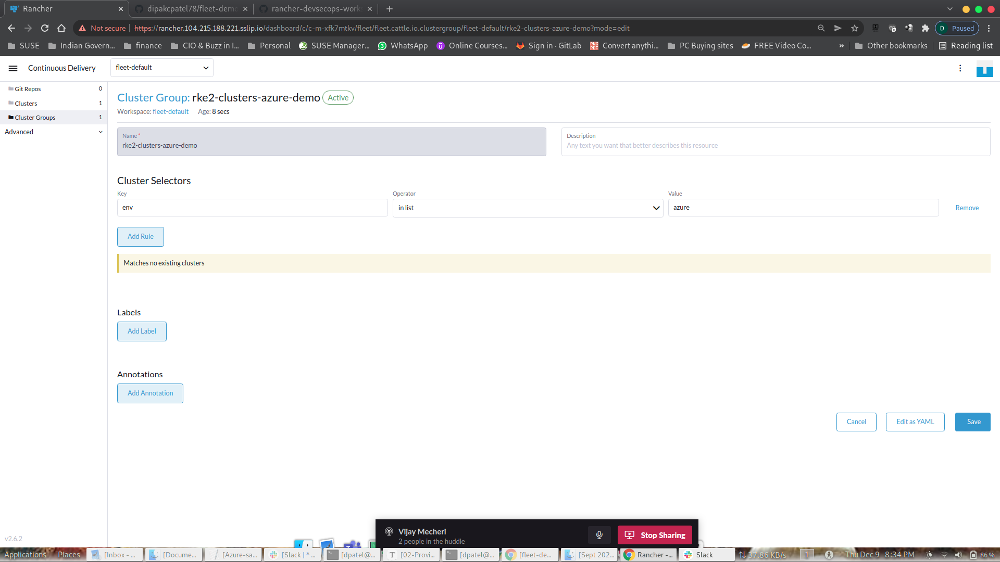
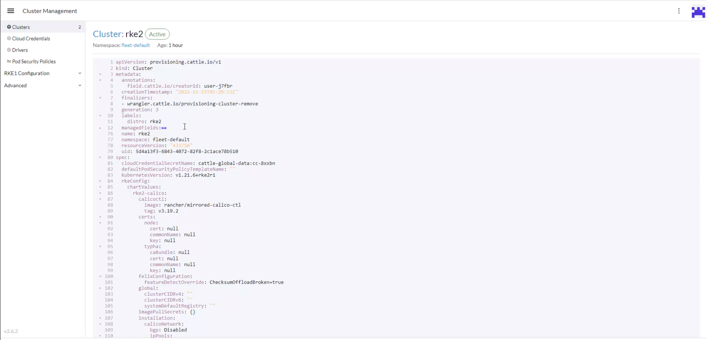
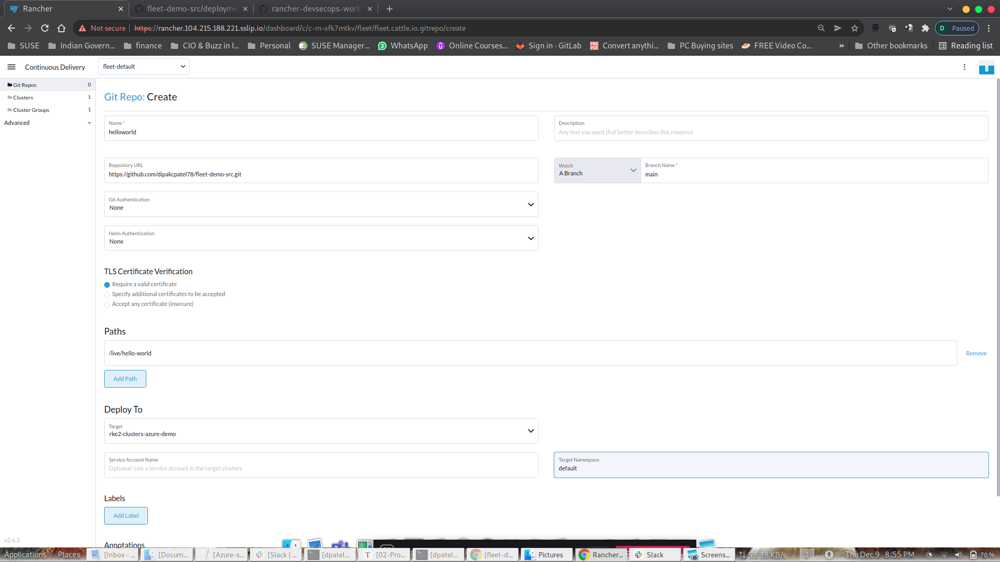
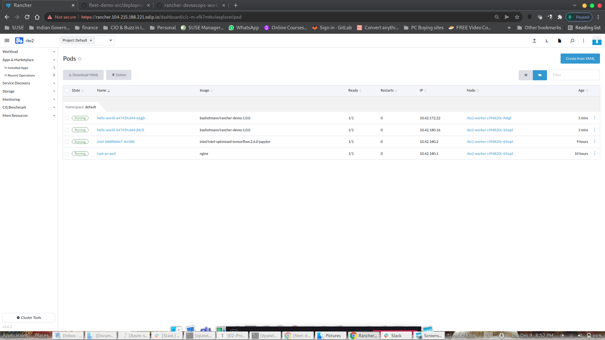
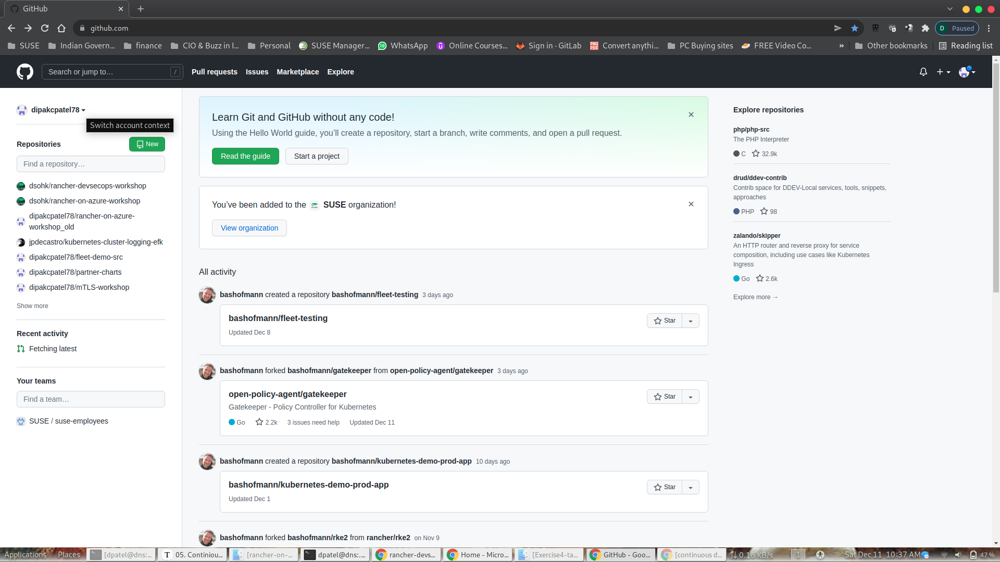
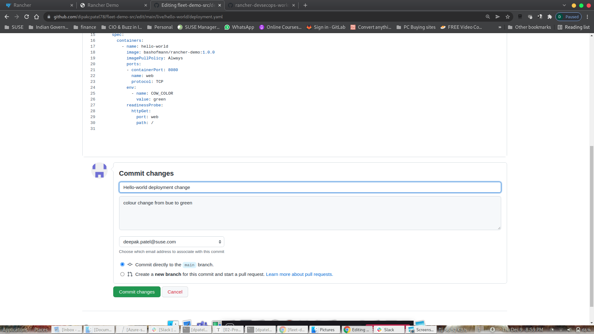
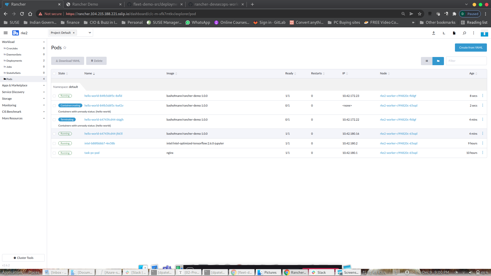

# Exercise 5 Continous Deployment (Fleet)

What is Fleet ?

Fleet is GitOps at scale. Fleet is designed to manage up to a million clusters. It’s also lightweight enough that it works great for a [single cluster](https://fleet.rancher.io/single-cluster-install/) too, but it really shines when you get to a [large scale.](https://fleet.rancher.io/multi-cluster-install/) By large scale we mean either a lot of clusters, a lot of deployments, or a lot of teams in a single organization.

Fleet comes preinstalled in Rancher and is managed by the **Continous Delivery** option in the Rancher UI.


## Task 1 - Setup Rancher Continuous Delivery (CD)

1. Click the top left 3-line bar icon to expand the navigation menu. Click **Continuous Delivery** menu item.


Before we proceed, let's verify if we can see all our cluster in Continuous Delivery

2. Create a Cluster Group
   1. Under Continious Delivery, navigate to `Cluster Group` and click on `Create`. Give it a name of your choise.
   2. Under Cluster Selector provide the following values Key:`distro` Operator: `in list` Value:`rke2`
   3. Rancher Fleet will use the key: value pair to match to clusters to identify the cluster to be associated with newly created Cluster Group in Rancher Continious Delivery. 
   4. Click on `save` which will create our first Cluster Group.



We will see 1 cluster to match the label we have used for the Cluster Group. RKE2 Cluster has the same cluster label & hence you should see 1/1 matching as result. 

In-case, if you have missed this step, you can add cluster label later once the cluster is up & running. 

In order for us to set label to RKE2 cluster

1. Click the top left 3-line bar icon to expand the navigation menu. Click **Cluster Management** menu item.
2. Click on the 3 Vertical dots to Edit the config of the RKE2 cluster
3. Head to teh Cluster Configuration - Labels and Annotations Page
4. Under Labes provide key:value pair. In our case **Key:`distro`**  and **Value: `rke2`**


In-case if you receive error, you can also edit the YAML file to add the cluster label.

Need to add one more snippit to show the YAML which show the cluster label. It would be under the Cluster Meta data Section & should say

ApiVersion: provisioning.cattle.io/v1

kind: Cluster

metadata:

  labels: 

​    distro=rke2 (Yaml indentation required)



## Task 2 - Configure Git Repo

In previous exercise, we have configured stateful application. In this exercise, you will configure a simple stateless web  application **Hello-World**which will spin up 2 container Pod with Rancher logo. The application is available at GitHub.

1. In Rancher UI > `Global Apps` > `Continous Delivery` > `Git Repos` click on `Create` 

2. Give a name to your Git Rep `Name` 

3. Paste the Git Repo URL in `Repository URL`. 

   Sample Git Repo url is - https://github.com/dipakcpatel78/fleet-demo-src.git

   ```
   https://github.com/dipakcpatel78/fleet-demo-src.git
   ```

   

4. In the Branche Name type `main` 

5. Paths - /live/hello-world

    

   ```
   /live/hello-world
   ```

   

5. Use the dropdown option and select the Cluster Group we created previosuly

6. Provide a Namespace `default`

7. Leave the rest as default



You have successfully completed Rancher Continuous Delivery configuration.

Fleet is now configured to watch the application **Hello-World** for code/configuration in GitHub & any changes to the code/configuration will be picked up & be deployed on the target cluster cluster assigned to the cluster group. 

Once the Git Repo is created, it will initate the reconciliation


Once the reconciliation is completed, you can observe the Deployment, Pod & the Services section of the RKE2 Cluster for the App. 

Deployment/Pods in default Namespace



Deployment/Pods - Services Discovery - Services - Default Namespace


Click on the Nodeport & the application would open a new browser window


Now we have our Application **Hello-World** Deployed & Running.  We have successfully completed the application rollout for application residing in GitHub to our cluster. 

#### **Next following steps are not part of this workshop as it require all to have own personal GitHub Account and hence I am going to demonstrate the next steps for you to see how Fleet support your CI/CD requirements**  

Customer would seek new features/services/provide feedback for our Software/Services. To incorporate changes we will need to make necessary code changes. With Continuous Integration (CI), Continuous  Deployment (CD) process, we can quickly act of the changes required, do small incremental changes, test them & then roll out the changes quickly to market. 

Let's see how we can use CI & make use of CD to quickly rollout the changes.

Login to personal GitHub Account. You will see your GitHub ID on the Left Top Corner. Mine is **dipakcpatel78**.  You will have your own ID name reflecting. 



In the GitHub Search for "dipakcpatel78/fleet-demo-src" and select it. GitHub will take you the Public Repo available. 

```
dipakcpatel78/fleet-demo-src
```


Click on Fork Icon on the right hand top corner of the Github page which will for the repo to your own Github account. Following this you will be able to see the content for the repo.


Go to the Folder `'live/hello-world'`  Section & locate `deployment.yaml`


Let's make some simple changes.

1.  Change the Container Background Color 
2. Increase the Application Container to meet workload demand.

To make changes, click on the Pencil like Icon to edit the Deployment Definition.

Below is the Deployment definition. Will change 2 lines of our deployments from it's present value to new desired value

Line 7: Replicas: 5

Line 26: value: Green


Provide your own description on the commit and save the changes. 



Fleet will pickup changes commited in GitHub and check the current state of the cluster. It will identify that the new desired state required changes and Fleet will begin reconcilization process.  Fleet will ensure the desired cluster state is meet by doing the needful. In our case Deployment Replica count will be bumped from 2 to 5, So additional 3 Containers will be created & the background color of the container from Blue will change to Green

Additional container spining up to meet the new desired Deployment definition. 



If you observe your browser will see the additional container getting created & the background color changing from Blue to Green. In all you will 5 containers. 


In this exercise you have configured Fleet for Continious Delivery. Remember Fleet is GitOps at scale. Fleet is designed to manage up to a million clusters.

If you are interested, to explore power of Fleet in DevSecOps world, we have another hands-on workshop we have covered the Application life-cycle using Fleet to more close production like scenario. You can explore it to see how SUSE Rancher integrate easily with Github (Version Control), Jenkins (CI Build Server), Maven (Java Build Tool), Harbor (Container Image Registry), Kaniko (Container Image Builder), Sonarqube (Static Code Analysis) ,  Anchore (Container Image Vulnerability Scanner ).

More details on GitHub Link below.

https://github.com/dsohk/rancher-devsecops-workshop.git

### Next steps

That's the end of the workshop. Hope you enjoy it and do let us know what you think to make this better. If you are interested to explore further how SUSE Rancher can help your organization to transform your business digitally, please reach out to us.

Last thing. 

### Next steps

**When you have finished playing with your lab environment go to part 6 - clearning up the lab environement [next exercise](./06-CleanUpLab.md) of the lab "CleanUpLabEnvironment".**

